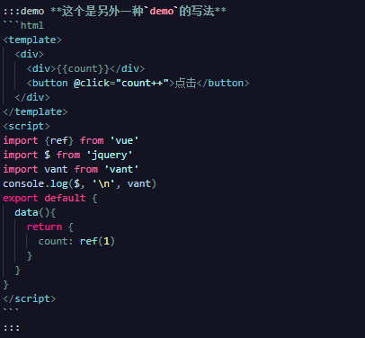

# 另外一种写法

前面提到了，个人不倾向于在docs中另起文件写demo（naive也是把demo文件和开发文件一起组织的，并没有放在docs下面）。所以借鉴了element-ui的写法，根据markdown-it-container提供了一个demo的container：

```vue
:::demo **这个是另外一种`demo`的写法**
your sfc code here
:::
```

如下图所示：



## 额外配置的项

因为目前vitepress并没有提供vite的plugin的相关配置，所以我这里暂时没想到什么好的办法，只能在运行的项目中修改vitepress代码了。如果您有什么好的意见，可以提出来。

1. 在node_modules目录中找到vitepress/dist/node/plugin.js
2. 页面底部，找到`return [vitePressPlugin, vuePlugin]`类似的代码
3. 修改为下面的代码（就是vite官网教程上面提供的"[引入一个虚拟文件](https://cn.vitejs.dev/guide/api-plugin.html#importing-a-virtual-file)"的功能）：
```js
  const createDemoPlugin = () => {
    const virtualFileId = /^@vitepress-demo-\d+-([\d\D]+)(.vue|.md)$/
    return {
      name: 'demo-plugin', // 必须的，将会在 warning 和 error 中显示
      resolveId (id) {
        if (id.match(virtualFileId)) {
          return id
        }
      },
      load (id) {
        const matching = id.match(virtualFileId)
        if (matching) {
          // 源码字符串采用了base64编码，此处进行解码
          const result = new Buffer.from(matching[1], 'base64').toString()
          return result
        }
      }
    }
  }

  return [vitePressPlugin, vuePlugin, createDemoPlugin()];
```
或者为（vitepress-plugin-demo提供了相关的函数，直接引入）：
```js
return [vitePressPlugin, vuePlugin, require('vitepress-plugin-demo/lib/virtualFile')()];
```

## 示例

:::demo **这个是另外一种`demo`的写法**
```html
<template>
  <div>
    <div>{{count}}</div>
    <button @click="count++">点击</button>
  </div>
</template>
<script>
import {ref} from 'vue'
import $ from 'jquery'
import vant from 'vant'
console.log($, '\n', vant)
export default {
  data(){
    return {
      count: ref(1)
    }
  }
}
</script>
```
:::

## import

这里的实现借助了vite插件：引入一个虚拟文件，没有采用硬编码，这里的import都会正常引入，更加方便的编写demo示例

<!-- 下面是测试 -->

<div class="test" style="display: none;">{{count}},{{count2}}</div>

<script>
export default {
  data(){
    return {
      count: 123
    }
  }
}
</script>

<script setup>
const count2 = 123
</script>

<style>
.test{
  display: none;
}
</style>